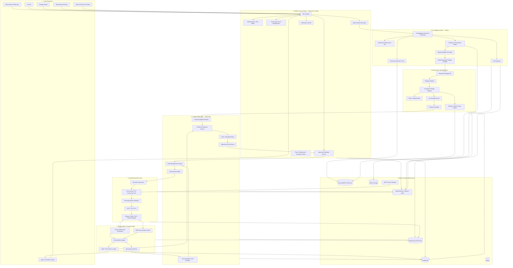
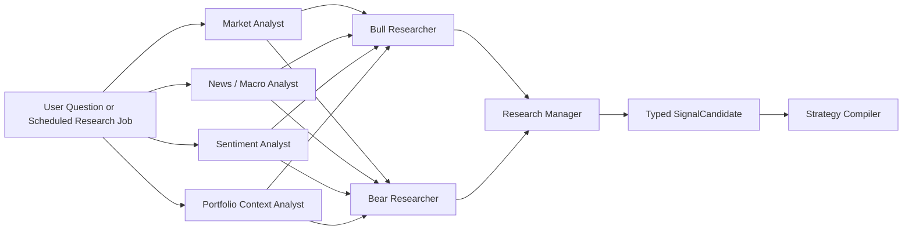
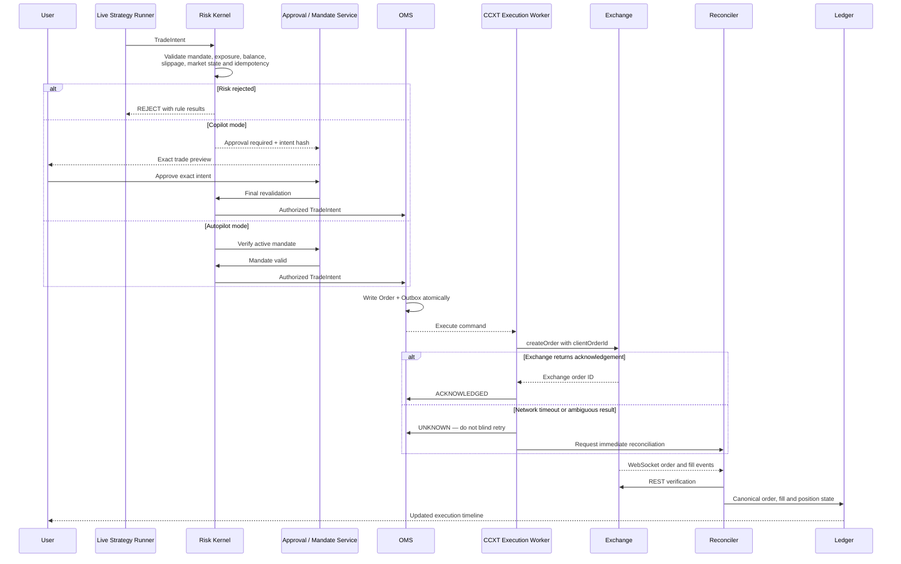

# Final system architecture

Build the platform as **three strictly separated planes**:

1. **AI Intelligence Plane** — researches markets, debates ideas, explains decisions, and produces structured strategy proposals.
2. **Strategy and Control Plane** — converts proposals into deterministic strategies, validates them, backtests them, manages permissions, and evaluates risk.
3. **Execution and Ledger Plane** — submits authorized orders through CCXT, tracks fills, reconciles exchange state, and maintains the financial source of truth.

The fundamental rule is:

> **The LLM never receives exchange credentials and never calls `createOrder()` directly.**

```text
AI proposes
→ strategy compiler structures
→ deterministic risk engine authorizes
→ user or mandate approves
→ OMS records
→ CCXT worker executes
→ reconciliation confirms
→ ledger becomes truth
```

For the first production version, I would assume:

* Centralized crypto exchanges.
* Spot trading first.
* One exchange initially.
* User-owned exchange accounts.
* Trade-only API keys with withdrawals disabled.
* Hosted execution workers.
* Copilot mode before Autopilot mode.

---

# 1. Complete logical architecture



---

# 2. The most important separation: two different kinds of agents

The word “agent” should not refer to a single unrestricted AI process.

## AI research agent

This is where TradingAgents belongs.

It can:

* Analyze market data.
* Retrieve news and sentiment.
* Inspect a sanitized portfolio snapshot.
* Produce bullish and bearish arguments.
* Identify uncertainty.
* Generate an evidence-backed `SignalCandidate`.
* Draft or modify a strategy.
* Explain why an existing strategy acted.

It cannot:

* Access an API secret.
* Decide whether an order passes hard risk limits.
* Submit, cancel, or modify exchange orders.
* Retry an unknown exchange request.
* Override an agent mandate.
* Disable a stop-loss.
* Change its own permissions.

TradingAgents is currently organized around LangGraph and role-specialized analysts, researchers, risk debaters, and decision agents. Recent releases also added structured decision output, checkpointing, and a persistent decision log. That makes it appropriate for asynchronous research workflows, but not as your financial execution authority. ([GitHub][1])

## Live trading agent

The live trading agent is not primarily an LLM. It is a deterministic runtime consisting of:

```text
Immutable StrategyVersion
+ Market-data subscription
+ Indicator calculations
+ Position state
+ AgentMandate
+ Risk rules
+ OMS
```

It monitors the exact strategy conditions and emits a `TradeIntent` when those conditions are satisfied.

The AI may explain the signal afterward, but the AI should not reinterpret the strategy on every candle.

---

# 3. AI Intelligence Plane

I recommend keeping TradingAgents in a separate Python service:

```text
Fastify platform
      |
      | ResearchJob
      v
Python TradingAgents Service
      |
      | SignalCandidate / StrategyDraft
      v
TypeScript Strategy and Trading Core
```

## Recommended research workflow



Every external fact should become a structured evidence record:

```ts
interface EvidenceReference {
  sourceId: string;
  sourceType: "MARKET_DATA" | "NEWS" | "SOCIAL" | "MACRO" | "PORTFOLIO";
  title: string;
  eventTime?: string;
  publishedTime?: string;
  retrievedTime: string;
  availableToStrategyTime: string;
  contentHash: string;
  relevance: number;
}
```

This is necessary for:

* Explaining recommendations.
* Detecting stale information.
* Avoiding look-ahead bias in backtests.
* Reproducing an AI decision.
* Comparing later outcomes with the original evidence.

## Output of the AI layer

The AI layer should output an advisory artifact, not an order:

```ts
interface SignalCandidate {
  signalId: string;
  createdAt: string;
  informationCutoff: string;

  assetQuery: string;
  direction: "LONG" | "SHORT" | "EXIT" | "NO_ACTION";
  horizon: "INTRADAY" | "SWING" | "POSITION";

  confidence: number;
  thesis: string;
  supportingEvidence: EvidenceReference[];
  opposingEvidence: EvidenceReference[];

  entryConditions: string[];
  invalidationConditions: string[];
  suggestedRiskBudgetBps?: number;

  modelVersion: string;
  promptVersion: string;
  evidenceBundleHash: string;
}
```

The field `assetQuery` can say “Bitcoin,” but it is not executable until the deterministic market resolver maps it to something exact such as:

```text
Exchange: Binance
Market type: Spot
Unified CCXT symbol: BTC/USDT
Exchange market ID: BTCUSDT
Base: BTC
Quote: USDT
Settlement asset: N/A
```

---

# 4. Strategy lifecycle

A strategy must be a first-class, immutable artifact.

```text
DRAFT
→ VALIDATED
→ BACKTESTED
→ PAPER_RUNNING
→ PAPER_PASSED
→ APPROVED
→ LIVE
→ PAUSED
→ RETIRED
```

The AI can generate the draft, but deterministic code must validate and execute it.

## Restricted strategy DSL

Use JSON rather than generated Python or JavaScript:

```json
{
  "strategyId": "btc-rsi-recovery",
  "version": 4,
  "market": {
    "exchange": "binance",
    "marketType": "spot",
    "symbols": ["BTC/USDT"],
    "timeframe": "15m"
  },
  "entry": {
    "all": [
      {
        "indicator": "rsi",
        "period": 14,
        "operator": "crossesAbove",
        "value": 30
      },
      {
        "indicator": "volume",
        "operator": "greaterThanSma",
        "period": 20
      }
    ]
  },
  "exit": {
    "any": [
      {
        "type": "takeProfitPercent",
        "value": 4
      },
      {
        "type": "stopLossPercent",
        "value": 2
      },
      {
        "indicator": "rsi",
        "period": 14,
        "operator": "greaterThan",
        "value": 70
      }
    ]
  },
  "sizing": {
    "type": "riskPercent",
    "riskPercent": 1
  }
}
```

No unrestricted source code should run inside the production trading worker.

## One engine for all three environments

The exact same strategy evaluator should run in:

* Backtesting.
* Paper trading.
* Live trading.

Only the data and broker adapters change.

```text
BacktestBroker
PaperBroker
LiveOMSBroker
```

This reduces the gap between historical results and live behavior. Minara publicly describes this same strategy lifecycle: natural language is converted into a structured spec, tested, paper-traded on the live execution engine, and then promoted with the same rules and risk hooks. ([Minara.ai][2])

---

# 5. Agent mandate and authorization model

Autopilot should never mean “the AI has unlimited trading access.”

It means:

> The user has approved a specific immutable strategy version to trade within a specific bounded mandate.

```ts
interface AgentMandate {
  mandateId: string;
  userId: string;
  accountId: string;
  agentId: string;
  strategyVersionId: string;

  allowedSymbols: string[];
  allowedMarketTypes: Array<"SPOT" | "MARGIN" | "SWAP">;
  allowedSides: Array<"BUY" | "SELL">;
  allowedOrderTypes: Array<"MARKET" | "LIMIT">;

  maxOrderNotional: string;
  maxPositionNotional: string;
  maxPortfolioExposure: string;
  maxDailyTurnover: string;
  maxDailyLoss: string;
  maxDrawdown: string;
  maxSlippageBps: number;
  maxLeverage: string;

  requireStopLoss: boolean;
  allowShorting: boolean;
  allowPositionReversal: boolean;

  startsAt: string;
  expiresAt: string;
  revokedAt?: string;
}
```

The mandate must be checked on every order—not only when the agent starts.

## Operating modes

### Research mode

* Read-only.
* No order creation.
* Suitable for initial launch.

### Copilot mode

* AI creates a trade preview.
* Deterministic risk checks run.
* User must approve the exact order.
* Approval expires quickly.

### Autopilot mode

* User approves an immutable strategy and mandate.
* Individual orders do not require manual confirmation.
* Every order still goes through deterministic risk checks.
* User can pause or revoke immediately.

Minara’s current Autopilot description follows a similar separation: it says live automation follows deterministic signals and mandatory risk controls inside a user-authorized trading scope rather than allowing discretionary AI trades. ([Minara.ai][3])

---

# 6. TradeIntent: the boundary before execution

The live strategy runner must never produce a raw CCXT call. It produces a typed intent:

```ts
interface TradeIntent {
  intentId: string;
  idempotencyKey: string;

  tenantId: string;
  accountId: string;
  agentId: string;
  mandateId: string;
  strategyVersionId: string;
  signalId: string;

  exchange: string;
  environment: "SANDBOX" | "LIVE";
  marketType: "SPOT" | "MARGIN" | "SWAP";
  symbol: string;

  side: "BUY" | "SELL";
  orderType: "MARKET" | "LIMIT";

  baseAmount?: string;
  quoteNotional?: string;
  limitPrice?: string;
  stopPrice?: string;

  reduceOnly: boolean;
  maxSlippageBps: number;

  marketSnapshotId: string;
  portfolioSnapshotId: string;

  createdAt: string;
  expiresAt: string;
}
```

Use decimal strings for prices, quantities, fees, and balances. Do not use JavaScript or Python floating-point values as the authoritative monetary representation.

The LLM must not be allowed to supply or modify:

* `tenantId`
* `accountId`
* `mandateId`
* `idempotencyKey`
* `riskDecisionId`
* `approvalId`
* `clientOrderId`
* Exchange credentials

Those values are created by trusted platform services.

---

# 7. Deterministic risk kernel

The risk kernel is the actual authorization authority.

It should evaluate:

```text
TradeIntent
+ AgentMandate
+ StrategyVersion
+ Account balance
+ Current positions
+ Open orders
+ Daily P&L
+ Market metadata
+ Current market price
+ Exchange health
+ System circuit-breaker state
```

## Mandatory pre-trade checks

At minimum:

* Agent is active.
* Mandate is active and not expired.
* Strategy version matches the approved version.
* Account and exchange are enabled.
* Symbol and market type are permitted.
* Order type is permitted.
* Amount and price meet exchange precision.
* Minimum and maximum order limits are satisfied.
* Available balance is sufficient.
* Maximum order notional is respected.
* Maximum position exposure is respected.
* Portfolio exposure remains within limits.
* Daily turnover remains within limits.
* Daily loss and drawdown limits have not fired.
* Market data is fresh.
* Proposed price is within the slippage band.
* No conflicting open order exists.
* Intent has not already been processed.
* Exchange connectivity is healthy.
* Reduce-only is set when required.
* Stop-loss exists when required.

The result must be structured:

```ts
interface RiskDecision {
  riskDecisionId: string;
  intentId: string;
  decision: "ALLOW" | "REJECT" | "REQUIRE_APPROVAL";

  policyVersion: string;
  portfolioSnapshotId: string;
  marketSnapshotId: string;

  checks: Array<{
    rule: string;
    result: "PASS" | "FAIL";
    observedValue?: string;
    limitValue?: string;
    reason?: string;
  }>;

  intentHash: string;
  createdAt: string;
  expiresAt: string;
}
```

A risk approval should expire within seconds. It must not remain reusable after the market, balance, position, strategy, or mandate changes.

---

# 8. Human approval model

For Copilot trades, display the exact executable values:

```text
Exchange: Binance
Account: Main Spot Account
Market: BTC/USDT Spot
Action: Buy
Order type: Limit
Quantity: 0.005 BTC
Limit price: 62,500 USDT
Maximum notional: 312.50 USDT
Estimated fee: ...
Maximum allowed slippage: 20 bps
Strategy version: v4
Risk checks: 14 passed
Approval expires: 30 seconds
```

Approval must bind to the exact intent hash:

```text
SHA-256(
  accountId
  + exchange
  + marketType
  + symbol
  + side
  + orderType
  + quantity
  + price
  + stopPrice
  + reduceOnly
  + maxSlippageBps
  + strategyVersionId
  + expiresAt
)
```

Changing any parameter invalidates the approval and forces a new risk evaluation.

---

# 9. Order Management System

CCXT must sit underneath an internal OMS.

The OMS owns the internal state machine:

```text
DRAFT
→ RISK_REJECTED
→ AWAITING_APPROVAL
→ AUTHORIZED
→ QUEUED
→ SUBMITTING
→ ACKNOWLEDGED
→ PARTIALLY_FILLED
→ FILLED
→ CANCELLING
→ CANCELLED
→ REJECTED
→ UNKNOWN
→ RECONCILING
```

`UNKNOWN` is essential.

It means:

> The submission may have reached the exchange, but the platform did not receive a definitive response.

An unknown submission must not be blindly retried.

## Transactional outbox

When authorizing an execution, make one PostgreSQL transaction that writes:

1. The internal order record.
2. The authorization record.
3. The outbox command.

```text
BEGIN

INSERT INTO orders ...
INSERT INTO order_authorizations ...
INSERT INTO outbox_events ...

COMMIT
```

The execution worker consumes the outbox event afterward.

This prevents:

* Recording an order without scheduling it.
* Scheduling an order without recording it.
* Losing a command between database and queue.

---

# 10. Correct live-order sequence



---

# 11. CCXT integration design

CCXT is the exchange adapter—not the platform’s financial domain model.

## Connection manager

Maintain a long-lived instance keyed approximately by:

```text
tenantId
+ exchangeAccountId
+ environment
+ marketType
```

Do not instantiate a new exchange object for every request. CCXT documents that the rate limiter belongs to each exchange instance, meaning multiple short-lived instances do not coordinate their limits. ([CCXT][4])

## Capability registry

At account connection time, inspect and store capabilities including:

```text
createOrder
editOrder
cancelOrder
cancelAllOrders
fetchOpenOrders
fetchClosedOrders
fetchMyTrades
fetchPositions
watchOrders
watchMyTrades
watchBalance
watchPositions
clientOrderId
sandbox
stopLoss
takeProfit
```

Exchange support and parameters vary, even when CCXT provides a unified method interface. CCXT maintains an exchange-by-method capability specification for this reason. ([CCXT][5])

Your adapter should reject unsupported operations before they reach the exchange.

## Exchange-specific adapter

Use an internal interface:

```ts
interface ExchangeExecutionAdapter {
  validateIntent(intent: TradeIntent): Promise<ValidationResult>;
  createOrder(command: AuthorizedOrderCommand): Promise<OrderSubmissionResult>;
  cancelOrder(command: CancelOrderCommand): Promise<CancelResult>;
  fetchOrder(query: FetchOrderQuery): Promise<NormalizedOrder>;
  fetchOpenOrders(accountId: string): Promise<NormalizedOrder[]>;
  fetchMyTrades(accountId: string): Promise<NormalizedFill[]>;
  fetchBalances(accountId: string): Promise<NormalizedBalance[]>;
  fetchPositions(accountId: string): Promise<NormalizedPosition[]>;
}
```

Then provide implementations such as:

```text
BinanceSpotAdapter
BybitSpotAdapter
BybitSwapAdapter
OKXSpotAdapter
```

The adapter is responsible for:

* Mapping unified symbols to exchange IDs.
* Price and amount precision.
* Minimum notional.
* Trigger-order syntax.
* Margin and position mode.
* Exchange-specific parameters.
* Normalizing errors.
* Mapping exchange states into OMS states.

## WebSocket plus REST

Use CCXT Pro private streams for low-latency order, trade, balance, and position updates. However, those streams are cached and connection-oriented, so they must be combined with periodic REST reconciliation rather than treated as permanent financial history. ([CCXT][6])

Recommended pattern:

```text
WebSocket = speed
REST reconciliation = recovery and correctness
PostgreSQL ledger = durable platform record
```

---

# 12. Idempotency and ambiguous submissions

Every intended trade needs:

```text
TradeIntent ID
→ Internal Order ID
→ Client Order ID
→ Exchange Order ID
→ Fill IDs
```

Example:

```text
intent_01K...
order_01K...
clientOrderId = aip_01K...
exchangeOrderId = 48273928473
```

On timeout:

1. Mark the order `UNKNOWN`.
2. Search by `clientOrderId` when supported.
3. Fetch recent open orders.
4. Fetch recent closed orders.
5. Fetch recent personal trades.
6. Match by account, symbol, side, quantity, price, and submission time.
7. Retry only after establishing that no order exists.

A queue-level “retry three times” policy must never be applied directly to `createOrder()`.

---

# 13. Reconciliation engine

The reconciler is as important as the execution worker.

It should run:

* Continuously from private WebSocket streams.
* Periodically through REST.
* Immediately after ambiguous submissions.
* On worker startup.
* After reconnects.
* After user manual actions.
* During scheduled full-account audits.

## Reconciliation checks

```text
Internal open orders vs exchange open orders
Internal fills vs exchange personal trades
Calculated balance vs exchange balance
Calculated position vs exchange position
Agent-owned orders vs manually created orders
Expected stop-loss orders vs actual exchange orders
Cancelled orders vs late fills
```

Manual user actions must be treated as intentional overrides:

* User manually closes position.
* Reconciler detects position change.
* Agent is informed.
* Pending strategy orders are cancelled or reevaluated.
* Agent must not silently reopen the position.

---

# 14. Circuit breakers and kill switches

Use several levels.

## Strategy-level

Pause one strategy when:

* Too many consecutive losses occur.
* Live slippage exceeds the tested range.
* Live behavior diverges materially from the backtest.
* Signal generation fails.
* Required data becomes stale.

## Account-level

Pause all agents on an account when:

* Daily loss limit is reached.
* Drawdown limit is reached.
* Position reconciliation fails.
* Unknown orders remain unresolved.
* Authentication fails repeatedly.
* Unexpected manual activity occurs.
* Balance falls below a safe threshold.

## Platform-level

Disable trading globally when:

* OMS or ledger is unavailable.
* Risk engine is unavailable.
* Audit logging fails.
* Exchange responses become inconsistent.
* Clock drift exceeds tolerance.
* A credential or infrastructure incident occurs.

Possible emergency actions:

```text
Pause new entries
Allow exits only
Cancel all agent-created open orders
Set reduce-only mode
Flatten positions
Disable one exchange
Disable all live execution
```

Flattening should be separately configurable because automatic market exits can themselves create significant losses.

---

# 15. Data architecture

## PostgreSQL

Use PostgreSQL as the main source of truth for:

* Users.
* Exchange-account metadata.
* Agents.
* Strategy versions.
* Mandates.
* Trade intents.
* Risk decisions.
* Approvals.
* Orders.
* Fills.
* Position snapshots.
* Outbox events.
* Reconciliation results.
* Audit metadata.

## TimescaleDB or ClickHouse

Use it for:

* Candles.
* Trades.
* Order-book snapshots.
* Funding rates.
* Indicators.
* Feature data.
* Backtest time series.
* Agent performance analytics.

Start with TimescaleDB when operational simplicity matters. Move high-volume analytical workloads to ClickHouse when necessary.

## Object storage

Store:

* Research evidence bundles.
* Generated reports.
* Backtest artifacts.
* Equity curves.
* Model evaluation datasets.
* Exported audit records.
* Archived raw exchange responses.

## Redis

Use Redis for:

* Short-lived caches.
* Distributed rate-limit counters.
* WebSocket session coordination.
* Temporary locks.
* Notifications.
* Non-authoritative job queues.

Do not use Redis as the authoritative store for orders, approvals, fills, or positions.

## Audit store

Every critical action should be append-only:

```text
Who or what acted
Input object hash
Before state
After state
Model and prompt version
Strategy version
Policy version
Risk decision
Approval identity
Order command
Exchange response
Reconciliation result
Trace ID
Timestamp
```

CCXT’s official MCP server uses a similar security pattern around previewing and confirming orders, validating market and notional limits, and recording actions in an append-only audit journal. That is a good model for your internal execution gateway, even though your SaaS should not expose raw CCXT tools directly to the LLM. ([CCXT][7])

---

# 16. Secret-management architecture

Exchange credentials should exist in plaintext only inside the isolated execution worker and only for the duration required.

```text
Exchange API secret
→ encrypted with per-account data-encryption key
→ key encrypted by cloud KMS
→ encrypted values stored in database
→ execution worker requests temporary decryption
→ plaintext held in memory
→ plaintext never persisted or logged
```

## Service permissions

| Component             |      Can use LLM | Can read portfolio |    Can access keys |           Can submit orders |
| --------------------- | ---------------: | -----------------: | -----------------: | --------------------------: |
| AI research service   |              Yes | Sanitized snapshot |                 No |                          No |
| Strategy compiler     | Yes, constrained |            Limited |                 No |                          No |
| Backtest service      |      No/optional |    Historical only |                 No |                          No |
| Live strategy runner  |               No |                Yes |                 No |                          No |
| Risk kernel           |               No |                Yes |                 No |                          No |
| OMS                   |               No |                Yes |                 No |                          No |
| Execution worker      |               No |   Account-specific |                Yes |                         Yes |
| Reconciliation worker |               No |                Yes | Private API access | No new discretionary orders |

Additional rules:

* Withdrawal permissions disabled.
* Exchange IP allowlisting enabled where available.
* Execution workers deployed in a private subnet.
* Egress restricted to approved exchange endpoints.
* AI service cannot reach KMS.
* Logs and error trackers apply secret redaction.
* Support staff cannot view plaintext keys.
* Separate sandbox and production credentials.

---

# 17. Recommended deployable services

Do not begin with 20 independent microservices.

Start with five deployable components.

## 1. `web`

```text
Next.js
Chat
Strategy Studio
Agent Console
Portfolio
Approval Center
Execution Timeline
```

## 2. `api-control`

A modular Fastify application containing:

```text
Authentication
User and organization management
Exchange-account metadata
Agent lifecycle
Strategy registry
Mandates and approvals
Notifications
Entitlements
Audit-query API
```

## 3. `ai-research`

Python service containing:

```text
TradingAgents / LangGraph
Model gateway
Research tools
Evidence builder
SignalCandidate generation
Natural-language strategy compiler
```

It has no exchange credentials.

## 4. `trading-core`

TypeScript service containing:

```text
Strategy runtime
Market resolver
Portfolio calculations
Policy engine
Risk kernel
OMS
Circuit breakers
Reconciliation coordination
```

## 5. `execution-worker`

A separately secured TypeScript service containing:

```text
CCXT
CCXT Pro
Connection pool
Exchange adapters
Order submission
Cancellation
Private exchange queries
Credential decryption
```

This service should have no LLM dependency.

## Suggested repository structure

```text
apps/
  web/
  api-control/

services/
  ai-research/
  trading-core/
  execution-worker/

packages/
  contracts/
  strategy-dsl/
  strategy-runtime/
  market-models/
  risk-rules/
  oms-models/
  exchange-adapters/
  audit/
  observability/

infra/
  terraform/
  kubernetes/
  monitoring/
```

Use a shared, versioned contracts package for:

```text
SignalCandidate
StrategySpec
TradeIntent
RiskDecision
AuthorizedOrderCommand
OrderEvent
FillEvent
PositionSnapshot
AuditEvent
```

---

# 18. Workflow and messaging infrastructure

For your first version:

```text
PostgreSQL transactional outbox
+ BullMQ/Redis workers
+ idempotent consumers
```

Use the transactional outbox for every fund-affecting command.

Long-running operations such as these can later move to Temporal:

* Multi-agent research.
* Historical data imports.
* Backtests.
* Walk-forward analysis.
* Paper-trading evaluations.
* Agent activation.
* Credential verification.
* Reconciliation recovery.
* Incident workflows.

Do not make the monetary order state dependent solely on BullMQ, Redis, or Temporal history. The authoritative OMS state remains in PostgreSQL.

Kafka is unnecessary for the initial system unless actual throughput proves otherwise.

---

# 19. Final product workflow

A user says:

> “Create a conservative BTC strategy that buys when RSI recovers from oversold conditions, but only when the news environment is not strongly negative.”

The system should execute this flow:

1. TradingAgents analyzes technical, sentiment, and news data.
2. It produces a `SignalCandidate` with evidence and opposing evidence.
3. The strategy compiler converts the request into a restricted DSL.
4. The strategy validator resolves unsupported or ambiguous rules.
5. The user reviews the exact structured strategy.
6. The backtest engine runs with fees and slippage.
7. Walk-forward and out-of-sample results are produced.
8. The user promotes the immutable version to paper trading.
9. Paper trading uses the same strategy evaluator as live trading.
10. After the paper gate passes, the user creates an `AgentMandate`.
11. The agent starts monitoring live market data.
12. When deterministic conditions fire, the runner creates a `TradeIntent`.
13. The risk kernel evaluates the current portfolio and mandate.
14. Copilot requests approval; Autopilot verifies the active mandate.
15. OMS writes the order and outbox event atomically.
16. The execution worker submits through CCXT.
17. WebSocket events update the order quickly.
18. REST reconciliation verifies the final state.
19. Fills and positions update the ledger.
20. The AI explains the action using the frozen strategy and evidence.
21. Outcomes feed into analytics and research memory, not directly into permission changes.

---

# 20. Recommended build sequence

## Phase 1: intelligence and simulation

Build:

* Exchange public market-data connection.
* AI research interface.
* TradingAgents service.
* Strategy DSL.
* Backtesting.
* Paper trading.
* Evidence and audit records.

No private API keys and no live orders.

## Phase 2: Copilot spot trading

Add:

* One exchange.
* Trade-only API keys.
* Portfolio and order synchronization.
* Deterministic risk engine.
* Human approval.
* OMS.
* CCXT execution worker.
* WebSocket and REST reconciliation.
* Kill switches.

Every live order requires explicit approval.

## Phase 3: bounded Autopilot

Add:

* Agent mandates.
* Strategy expiry.
* Position and exposure limits.
* Daily loss and drawdown controls.
* Mandatory stop-loss rules.
* Automatic pause conditions.
* Manual override behavior.
* Agent health dashboards.

## Phase 4: expansion

Only after the spot system is reliable:

* Additional exchanges.
* Margin.
* Perpetuals.
* Leverage and liquidation risk.
* Portfolio-level multi-agent coordination.
* Local execution daemon.
* Strategy marketplace.
* Institutional controls.

---

# Final recommendation

The final system should be organized around this trust chain:

```text
TradingAgents
    produces research and SignalCandidates
                ↓
Strategy Compiler
    produces an immutable StrategyVersion
                ↓
Backtest and Paper Engine
    validate expected behavior
                ↓
Live Strategy Runner
    produces a TradeIntent
                ↓
Policy and Risk Kernel
    authorizes the exact action
                ↓
User Approval or Agent Mandate
    grants permission
                ↓
OMS and Transactional Outbox
    establish durable order state
                ↓
Isolated CCXT Worker
    submits the authorized command
                ↓
WebSocket + REST Reconciliation
    establish what actually occurred
                ↓
Order, Fill and Position Ledger
    becomes the platform source of truth
```

The first components to freeze before building the chat interface are:

1. `StrategySpec`
2. `AgentMandate`
3. `TradeIntent`
4. `RiskDecision`
5. OMS state machine
6. Reconciliation rules

Everything else—including TradingAgents, model providers, exchanges, and user interfaces—can evolve around those contracts.

[1]: https://github.com/tauricresearch/tradingagents?utm_source=chatgpt.com "TradingAgents: Multi-Agents LLM Financial Trading ..."
[2]: https://minara.ai/product/strategy-studio?utm_source=chatgpt.com "AI Crypto Trading Strategy Builder | Minara"
[3]: https://minara.ai/product/autopilot-trading?utm_source=chatgpt.com "Minara Trading Autopilot | Rule-Based Perp Execution"
[4]: https://docs.ccxt.com/docs/manual?utm_source=chatgpt.com "Manual - CCXT Docs"
[5]: https://docs.ccxt.com/docs/base-spec?utm_source=chatgpt.com "API Spec by Method - CCXT Docs"
[6]: https://docs.ccxt.com/docs/pro-manual?utm_source=chatgpt.com "CCXT Pro Manual"
[7]: https://docs.ccxt.com/docs/mcp?utm_source=chatgpt.com "CCXT MCP Server"
